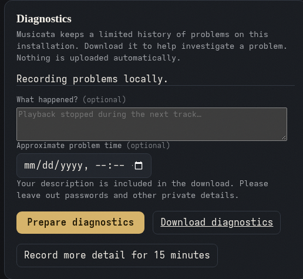

# Local diagnostics

Musicata retains operational problems locally. In **Settings → Diagnostics**, an
administrator can prepare and download a ZIP to share when investigating a problem.

Nothing is uploaded automatically. A description and approximate problem time are
optional; the description becomes part of the download, so leave out private details.

Ordinary operation is quiet. Successful HTTP requests are recorded only while
**Record more detail for 15 minutes** is enabled. You can stop this early; it always
starts disabled after a restart. Startup and fatal failures can still reach stderr
when internal recording is unavailable.

## Evidence and privacy

The download includes incident episodes with counts and recovery times, recent
playback/processing transitions, duration summaries, safe failure codes, version and
session information, and recorder loss counters. Output/source/track references are
hashed; names, addresses, filesystem paths, credentials and unrestricted exception
strings are excluded. It contains neither music nor the library database.

Browser and native audio clients report scoped audio, buffering, routing and DSP
failures. Server-owned MPD, Snapcast, source, persistence and analysis boundaries
retain their failures. Reports require authentication: an endpoint token can report
only for its own output; browser reports require a private capability for the current
renderer lease, so another listener or an old tab cannot recover its incidents.
Inspecting, exporting or enabling detail requires an administrator, including during
initial setup.

## Storage and limits

The diagnostic database lives beside the configured library database as
`<database>.diagnostics.db`. Supported native and Docker upgrades preserve that data
directory. The latest export is `<database>.diagnostics.zip`; it is replaced
atomically, with a temporary file during preparation. No additional installer option
is needed.

History expires after 14 days or earlier when resource limits require it. Cleanup
uses a persisted clock high-water mark plus monotonic elapsed time when the system
clock moves backwards, so corrected future timestamps cannot keep history forever. The
independent SQLite store has a 64 MiB page budget, checkpoints its WAL, and stops
writing if sidecar pressure cannot be reduced. Queues hold at most 512 inputs;
batches hold 128 events, each limited to 4 KiB. Active incidents are capped at 256,
recent transitions at 32 per output and 512 globally. Performance summaries use
five-minute buckets; unusually slow samples retain their own timestamps. Exports
are capped at 16 MiB; preparing one can temporarily use another 16 MiB. Omitted,
expired, evicted and lost evidence is counted explicitly.

Recording never waits for disk or network on playback controls or audio callbacks.
If the writer is blocked, its bounded queue can lose evidence while playback
continues. Musicata retries independently. If persistent history cannot be read,
a download can contain only the bounded pending evidence in memory; its context
identifies this as `pending_memory_only`, rather than claiming a complete history.
If the application-data directory itself is unwritable or full, export preparation
can also fail.

## What this establishes

Control durations of at least 250 ms, database reads of at least 50 ms, background
database writes of at least 250 ms and source first bytes taking at least 2 seconds
retain slow samples. Decode and background-job durations are summarized; a long
healthy scan is not classified as a failure. Preload failures and missed deadlines
use the backend's actual available playback time.

These signals identify reported software failures and delays. They cannot measure
analogue glitches, establish what reached the DAC, or prove uninterrupted audible
playback. Offline browser history is bounded; the native reporter coalesces five
categories into fixed pending failure/recovery state and spaces requests to respect
ingestion limits. Undelivered current recovery remains eligible for retry. Both
report known losses after reconnecting; a process killed abruptly can lose uncommitted evidence. Physical
output validation and sustained listening complement the automated checks.
